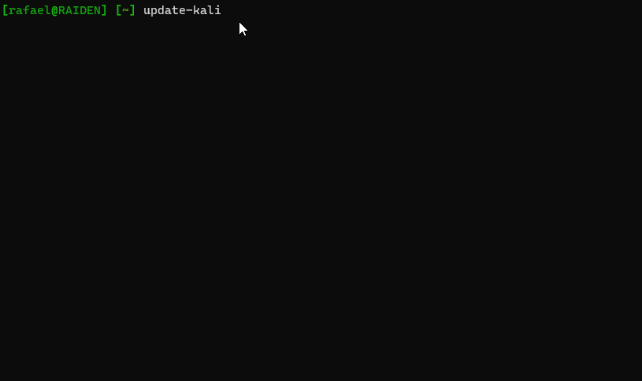

[](https://lgtm.com/projects/g/rafaelh/update-kali/context:python) [](https://twitter.com/rafael_hart)

# update-kali
This is a tool to set up Kali Linux quickly with additional packages and maintain them over time. You can also use this script with other debian-based distros like Ubuntu.



## What is this?
I need to keep a group of Kali linux boxes up to date, and I like them to be setup in a similar format. This script installs the tools I'm likely to use, creates directories, etc. It's set up for my personal use, but with a little modification you can use it too:

* Fork the repo so that you can commit your changes to `config.py`, and so the script updates from your account fork in future
* Update `config.py` with your preferences
* Go through `/scripts/`, delete the ones you don't want, and add any of your own that you want to run.
* Make sure you have the following installed: `python3`, `python-apt` and `git`.

## Config
The default config can be found in `config.py`. You should updated it to match what you want, otherwise you'll use my preferences and calamity will ensue. This script will:

* Perform a general package update
* Install and remove specified apt packages
* Install specified python modules, golang tools and ruby gems
* Set up and remove specified directories
* Sync specified git repos to `~/`, or a directory you nominate (private repos, such as dotfiles, notes, etc)
* Sync specified git repos to `/opt`, or a directory you nominate (public repos, such as wordlists)
* Run all the scripts in `/scripts`

**Note:** This script will change the ownership of your tools directory, which is `/opt` by default, to your user so that you aren't building with sudo privileges. Change the tools directory if you don't want that to happen.

## Supporting Scripts

### Updating Go modules
The Go modules you install will most likely keep on getting worked on, but you'll only get the benefit of those once you update and recompile the associated repository. This takes a long time, so I've added a separate command `update-go-modules` that iterates through updating them.

### Updating Python modules
You can update all python pip modules across the system using `update-python-modules`. Be aware that this may introduce breaking changes for your Python scripts, which is why venv is your friend. Expect to get errors when you run this, since some packages are supplied by the system.

### Updating Ruby Gems
As above, you can update all ruby gems with `update-ruby-gems`. This basically runs `gem outdated; gem update`, but it seemed consistent to put it into a script.

## Shell Scripts
Lastly, this tool will run each of the `.sh` or `.py` files in the `scripts` directory. If you add a script to this directory, make sure they can be run multiple times without causing a problem. You can use the following script that installs Google Chrome as a template:

``` sh
#!/bin/bash
set -Eeuo pipefail
trap "echo -e \"\033[1;31m[!] \e[0m Script error occured.\"" ERR

GREEN="\033[1;32m"
ENDCOLOR="\033[0m"

# === Exit without proceeding if run in WSL ===
if [ -f /mnt/c/Windows/System32/wsl.exe ]; then
    exit 0
fi

# Check if Chrome is installed
if [ $(sudo dpkg-query -W -f='${Status}' google-chrome-stable 2>/dev/null | grep -c "ok installed") -eq 0 ]
then
    echo -ne $GREEN"[+] "$ENDCOLOR; echo "Installing Google Chrome"
    cd ~
    wget https://dl.google.com/linux/direct/google-chrome-stable_current_amd64.deb
    sudo dpkg -i google-chrome-stable_current_amd64.deb
    rm -rf google-chrome-stable_current_amd64.deb
fi
```
